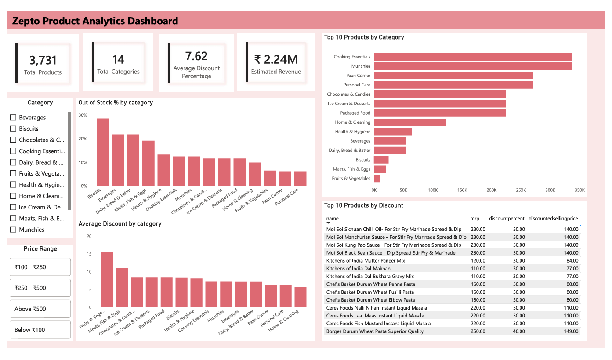

# 🛒 Zepto Product Analysis

## Project Overview

This project analyzes the Zepto Product Inventory dataset to uncover valuable business insights related to product pricing, discount strategies, inventory availability, and category performance.

The project demonstrates an end-to-end data analytics workflow including data exploration, data cleaning, SQL-based business analysis, and an interactive Power BI dashboard.

---

## Business Problem

Quick-commerce platforms manage thousands of products across multiple categories with varying prices, discounts, and inventory levels. Without proper analysis, it becomes difficult to optimize pricing strategies, monitor stock availability, identify high-performing categories, and maximize potential revenue.

This project aims to answer key business questions using SQL and Power BI.

---

## Objectives

- Analyze product distribution across categories
- Evaluate discount strategies
- Identify premium products that are out of stock
- Estimate revenue by product category
- Compare category-wise discount performance
- Analyze inventory availability
- Calculate value-for-money products using price per gram
- Build an interactive dashboard for business decision-making

---

## Dataset

**Dataset:** Zepto Inventory Dataset

- **Source:** Kaggle (https://www.kaggle.com/datasets/palvinder2006/zepto-inventory-dataset)
- **Format:** CSV

The dataset contains information such as:

- SKU ID
- Product Name
- Category
- MRP
- Discount Percentage
- Discounted Selling Price
- Available Quantity
- Weight (grams)
- Out of Stock Status
- Package Quantity

---

## Tools & Technologies

- SQL (PostgreSQL)
- Power BI
- Git & GitHub

---

## Project Workflow

### 1. Data Exploration

Performed exploratory analysis to understand the dataset by:

- Counting total products
- Checking data structure
- Identifying different product categories
- Comparing in-stock and out-of-stock products
- Identifying duplicate product names representing different SKUs
- Detecting missing values

---

### 2. Data Cleaning

- Removed products with zero MRP or selling price
- Converted MRP and discounted selling price from paise to rupees
- Verified data quality and consistency

---

### 3. SQL Analysis

Business questions answered using SQL:

- Top 10 products with the highest discounts
- High-priced products that are out of stock
- Estimated revenue by category
- Premium products with low discounts
- Categories offering the highest average discounts
- Price per gram analysis
- Product segmentation by weight
- Total inventory weight by category
- Out-of-stock percentage by category
- Category-wise price reduction analysis
- Product count by category

---

### 4. Power BI Dashboard

The dashboard includes:

- KPI Cards
  - Total Products
  - Total Categories
  - Average Discount Percentage
  - Estimated Revenue
- Top Product Categories
- Out-of-Stock Percentage by Category
- Average Discount by Category
- Top 10 Products by Discount
- Category Filter
- Price Range Filter

---

## Key Insights

- Several products offer discounts of **50% or more**, indicating aggressive promotional campaigns.
- Some high-priced products are currently **out of stock**, representing potential missed revenue opportunities.
- Certain products continue to sell **without any discounts**, indicating strong demand or premium positioning.
- **Fruits & Vegetables** have the highest average discount, suggesting frequent promotional pricing.
- Price-per-gram analysis identifies products offering the best value for money.
- Inventory weight varies significantly across categories, influencing storage and logistics planning.
- Out-of-stock analysis highlights categories requiring better inventory management.
- Category-wise price reduction reveals where the largest promotional investments are made.
- Product distribution analysis provides insights into category assortment and inventory diversity.

---

## Business Recommendations

- Review promotional campaigns to ensure high discounts generate profitable sales.
- Prioritize restocking premium products that frequently go out of stock.
- Maintain premium pricing for products that perform well without discounts.
- Optimize discount strategies for highly discounted categories while protecting profit margins.
- Use price-per-gram insights to improve pricing consistency and promote value-for-money products.
- Apply weight-based product segmentation to improve packaging, logistics, and warehouse planning.
- Monitor inventory weight regularly for efficient storage management.
- Track out-of-stock trends to improve inventory replenishment.
- Analyze category-wise discounts to optimize promotional spending.
- Maintain a balanced product portfolio by reviewing category-wise product distribution.

---

## Repository Structure

```
Zepto-inventory-sql-project/
│
├── Image.png
├── README.md
├── Zepto_analysis_report.pdf
├── zepto_analysis.sql
├── zepto_dashboard.pdf
├── zepto_v2.csv
├── zepto_visual.pbix
```

---

## Dashboard Preview

```markdown
### Zepto Product Analytics Dashboard


```

---

## Skills Demonstrated

- SQL Query Writing
- Data Cleaning
- Exploratory Data Analysis (EDA)
- Business Analysis
- Data Visualization
- Dashboard Design
- Business Insight Generation
- Storytelling with Data

---

## Future Improvements

- Inventory demand forecasting
- Product recommendation analysis
- Seasonal pricing analysis
- Automated Power BI dashboard refresh
- Customer purchase behavior analysis (if transactional data becomes available)

---

## Author

**Arpitha Hebbar**

Aspiring Data Analyst

**GitHub:** https://github.com/Arpi-K
