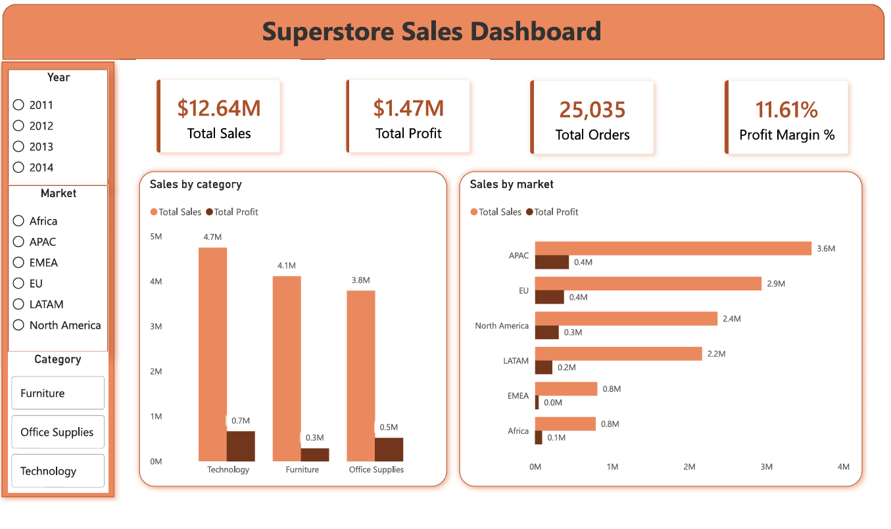
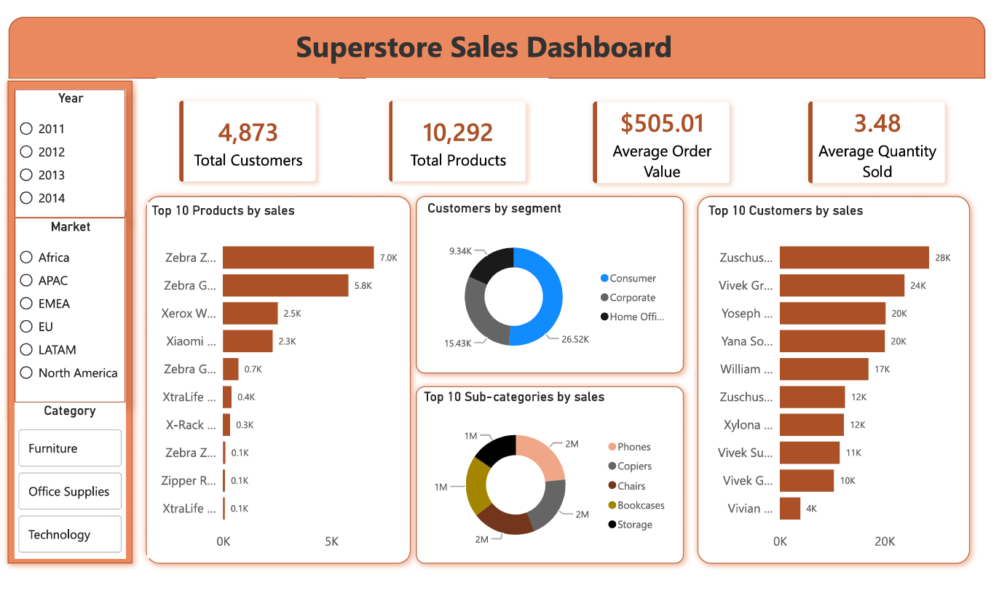
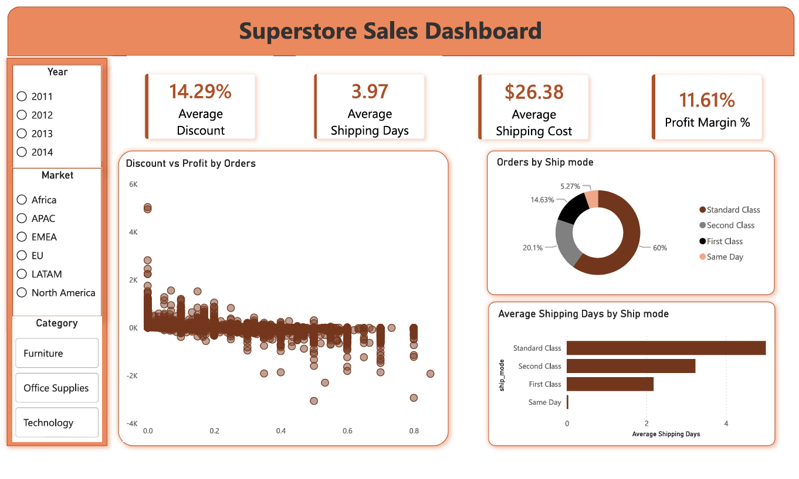

# 📊 Superstore Sales Analysis

## Project Overview

This project analyzes the Global Superstore dataset to uncover valuable business insights that can help improve sales performance, profitability, customer segmentation, and operational efficiency.

The project demonstrates an end-to-end data analytics workflow including data cleaning, exploratory data analysis (EDA), SQL-based business queries, and an interactive Power BI dashboard.

---

## Business Problem

Retail businesses generate large volumes of sales data every day. Without proper analysis, identifying profitable products, high-value customers, regional performance, and operational bottlenecks becomes difficult.

This project aims to answer important business questions using data analytics techniques.

---

## Objectives

- Analyze overall sales performance
- Identify top-performing products
- Identify high-value customers
- Compare regional and market performance
- Analyze profitability by category and segment
- Understand shipping trends
- Study the relationship between discounts and profits
- Build an interactive dashboard for decision-making

---

## Dataset

**Dataset:** Global Superstore Dataset

- Source: Kaggle (https://www.kaggle.com/datasets/fatihilhan/global-superstore-dataset)
- Format: CSV

The dataset contains information such as:

- Orders
- Customers
- Products
- Sales
- Profit
- Discount
- Shipping
- Market
- Region
- Category
- Sub-category

---

## Tools & Technologies

- Python
- Pandas
- NumPy
- Matplotlib
- SQL (MySQL)
- Power BI
- Git & GitHub

---

## Project Workflow

### 1. Data Cleaning (Python)

- Removed unnecessary columns
- Checked missing values
- Converted data types
- Created Shipping Days Column
- Verified data consistency

---

### 2. Exploratory Data Analysis

Performed analysis to understand:

- Sales distribution
- Profit trends
- Category performance
- Customer behavior
- Regional performance

---

### 3. SQL Analysis

Business questions answered using SQL:

- Top 10 countries by sales
- Top 10 customers
- Top 10 products
- Sales by market
- Average shipping time by market
- Shipping mode usage
- Discount vs Profit
- Category-wise sales and profit
- Month over month(MoM) growth
- Year-over-year sales growth

---

### 4. Power BI Dashboard

The dashboard includes:

- KPI Cards
- Sales Trend
- Profit Trend
- Sales by Category
- Sales by Market
- Top Customers
- Top Products
- Market Performance
- Shipping Analysis
- Interactive Filters
- Synchronised slicers

---

## Key Insights

- Identified the highest revenue-generating markets.
- Found the most profitable product categories.
- Discovered customers contributing the highest sales.
- Analyzed how discounts impact profitability.
- Compared shipping modes based on usage.
  
---

## Repository Structure

```
Superstore-Sales-Analysis/
│
├── Dataset/
├── Python/
├── SQL/
├── PowerBI/
├── PDF (Dashboard Images)/
├── Report/
└── README.md
```

---

## Dashboard Preview

```
### Dashboard Page 1



### Dashboard Page 2



### Dashboard Page 3



---

## Skills Demonstrated

- Data Cleaning
- Data Wrangling
- Exploratory Data Analysis
- SQL Query Writing
- Data Visualization
- Dashboard Design
- Business Insight Generation
- Storytelling with Data

---

## Future Improvements

- Sales forecasting using Machine Learning
- Customer segmentation using clustering
- Predictive profit analysis
- Automated dashboard refresh

---

## Author

**Arpitha Hebbar**

Aspiring Data Analyst

GitHub: https://github.com/Arpi-K
